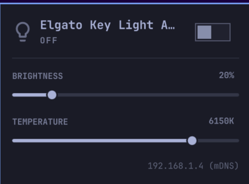

# omarchy-keylight-air

Control an Elgato Key Light Air from the Omarchy 4 bar: an icon that reads at
a glance, and a panel with power, brightness, and color temperature.



## What it does

- **Bar icon** that fills in when the light is on and dims to a muted outline
  when the light is off or unreachable.
- **Left-click** opens the control panel; **right- or middle-click** toggles
  the light without opening anything; **scroll** on the icon adjusts
  brightness ±5%.
- **Panel** with a power switch, a brightness slider (3–100%), and a color
  temperature slider shown in Kelvin (2900–7000K) — the mired units the
  Elgato API actually speaks stay internal. Enter toggles the light, Escape
  closes.
- **mDNS discovery** via avahi finds the light automatically; a static IP can
  be pinned in the widget settings to skip discovery. If the light drops off
  the network, the panel offers a rescan and the background poll self-heals
  when it comes back.
- Themed by the active Omarchy theme, like the first-party widgets.

## Install

```bash
omarchy plugin add https://github.com/fgonzal/omarchy-keylight-air --enable
```

Without `--enable`, add it to the bar later with:

```bash
omarchy plugin enable fgonzal.keylight-air --section right
```

## Settings

Stored in the widget's entry in `~/.config/omarchy/shell.json`:

| Key | Default | Meaning |
|-----|---------|---------|
| `host` | `""` | Pin the light's IP address and skip mDNS discovery. |
| `pollIntervalSec` | `30` | Background refresh cadence while the panel is closed. |

```bash
omarchy bar set fgonzal.keylight-air host 192.168.1.4
```

## Requirements

- Omarchy 4 (the Quickshell bar)
- `avahi-daemon` running, for automatic discovery (skip by setting `host`)
- `curl` (present on Omarchy)

## Uninstall

```bash
omarchy plugin remove fgonzal.keylight-air
```

No daemon, no state outside the plugin directory and its `shell.json` entry.

## License

MIT
